<div align="center">


<a href="https://github.com/Anipnipnip">
  
</a>

<p>
  
  
  
</p>

</div>


## 🕹️ PLAYER INFO

<table>
<tr><td width="55%" valign="top">

| Atribut             | Nilai                                         |
| :------------------ | :-------------------------------------------- |
| 👤 **Nama**         | Muhammad Fauzan Hanif                         |
| ⚔️ **Class**        | Backend Developer                             |
| 🐹 **Main weapon**  | Go (Golang)                                   |
| 🏙️ **Base**        | Jakarta, Indonesia                            |
| 🎯 **Level**        | Beginner                                      |
| 🧪 **Lagi belajar** | Go, REST API, PostgreSQL, Backend Development |
| ☕ **Bahan bakar**   | Kopi susu + lo-fi                             |
| 💼 **Status**       | Open to collaborate                           |

</td><td width="45%" valign="top">

**Misi saat ini**

```go
package main

type Developer struct {
    Name   string
    Role   string
    Stack  []string
    Focus  string
}

func main() {
    me := Developer{
        Name:  "Muhammad Fauzan Hanif",
        Role:  "Backend Developer",
        Stack: []string{"Go", "Node.js", "Express", "PostgreSQL"},
        Focus: "Backend development & REST API",
    }
    _ = me
}
```

</td></tr>
</table>

**Cara menghubungi**

```text
email    : mhanif091003@gmail.com
website  :
timezone : GMT+7 (WIB)
```


## ⚔️ SKILL STATUS

<div align="center">



</div>

**Tools & Teknologi**

<div align="center">

<br/>

</div>


## 📜 QUEST LOG

Proyek yang pernah dan sedang dikerjakan:

| Quest                   | Deskripsi                    | Stack             | Status    |
| :---------------------- | :--------------------------- | :---------------- | :-------- |
| **Klain Rasa**          | Website pemesanan untuk kafe | `MERN` `Midtrans` | 🟢 Active |
| **Kasir Go**            | REST API sistem kasir        | `Go` `PostgreSQL` | 🟡 WIP    |
| **Assessment Kumparan** | REST API artikel             | `Go` `PostgreSQL` | 🟢 Active |

<details>
<summary><b>🗝️ Side Quest — klik buat buka</b></summary>

<br/>

* 🌱 Belajar backend development menggunakan Go
* 🧪 Eksperimen dengan REST API dan PostgreSQL
* 📚 Mempelajari konsep backend dan software development

</details>


## 🏆 ACHIEVEMENTS

<div align="center">


</div>


## 📊 STATS

<div align="center">


<br/>


<br/>


</div>


## 🌐 CONNECT

<div align="center">

[](https://linkedin.com/in/mfauzhanif)
[](https://instagram.com/zhanipp)
[](https://facebook.com/zanhanhan)
[](mailto:mhanif091003@gmail.com)

</div>


<div align="center">
<sub>Kalau ada repo yang kepake, jangan lupa kasih ⭐ ya!</sub>
</div>
